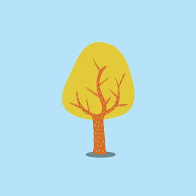
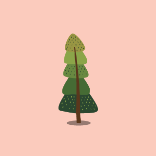

# Effects for Card Stacks

Refactored the inspirational card stack designs from Codrops to use ESNext, but mostly to understand how the animations work so I can add it to another project.

Some effect inspiration for card stacks. The idea is to show animation ideas for positive (accept) or negative (reject) feedback on a generic card element.

[Article on Codrops](http://tympanus.net/codrops/?p=25356)

[Original Demo](http://tympanus.net/Development/CardStackEffects/)

[Reworked Source Demo - this repo](https://globalroo.github.io/CardStackEffects/)


## Usage

```html
<ul id="stack_example" class="stack stack--example">
	<li class="stack__item"></li>
	<li class="stack__item"></li>
	<li class="stack__item"></li>
	<li class="stack__item"></li>
	<li class="stack__item"></li>
	<li class="stack__item"></li>
</ul>
<div class="controls">
	<button class="button button--sonar button--reject" data-stack="stack_example"><i class="fa fa-times"></i><span class="text-hidden">Reject</span></button>
	<button class="button button--sonar button--accept" data-stack="stack_example"><i class="fa fa-check"></i><span class="text-hidden">Accept</span></button>
</div>
```
```js
	const myStack = new CardStack("example", document.getElementById("stack_example"), options);
```
The individual stacks in the demo can be quickly created by using their specific class in the repo. For example:

```js
const yuda = new Yuda("stack_example");
```

## License

Integrate or build upon it for free in your personal or commercial projects. Don't republish, redistribute or sell "as-is".

Read more here: [License](http://tympanus.net/codrops/licensing/)

## Credits

[Dynamics.js](http://dynamicsjs.com/) by Michaël Villar

[Tree vector](http://www.freepik.com/free-photos-vectors/tree) designed by Freepik

## Misc

Follow Codrops: [Twitter](http://www.twitter.com/codrops), [Facebook](http://www.facebook.com/pages/Codrops/159107397912), [Google+](https://plus.google.com/101095823814290637419), [GitHub](https://github.com/codrops), [Pinterest](http://www.pinterest.com/codrops/)

[© Codrops 2015](http://www.codrops.com)
